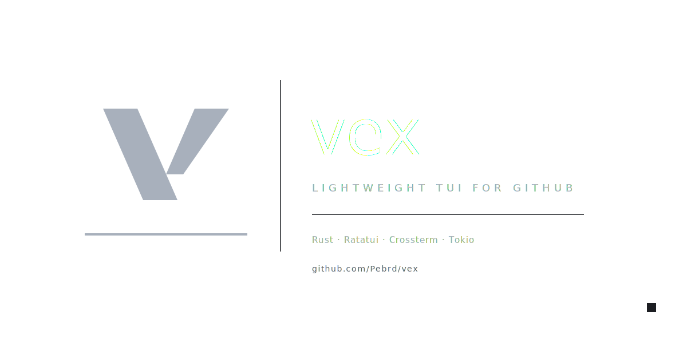

# vex

<div align="center">
  
</div>

Lightweight TUI for GitHub issues and pull requests

## Description

vex is a terminal user interface (TUI) application designed to interact with GitHub issues and pull requests efficiently. Built with Rust, it leverages the ratatui and crossterm libraries for a responsive and interactive terminal experience.

## Features

- Browse and filter GitHub issues and pull requests
- View detailed information about issues and PRs
- Interact with GitHub directly from your terminal
- Lightweight and fast performance

## Installation

### Prerequisites

- Rust toolchain (version 1.56 or later)
- GitHub account and personal access token (for API access)

### Build from Source

1. Clone the repository:
   ```bash
   git clone https://github.com/yourusername/vex.git
   cd vex
   ```

2. Build the project:
   ```bash
   cargo build --release
   ```

3. The binary will be available at `target/release/vex`

## Usage

Run the application with your GitHub personal access token:

```bash
vex --token YOUR_GITHUB_TOKEN
```

Or set the token as an environment variable:

```bash
export GITHUB_TOKEN=YOUR_GITHUB_TOKEN
vex
```

## Configuration

vex can be configured via a TOML file located at `$HOME/.config/vex/config.toml` (or platform equivalent). See the [configuration wiki](docs/wiki/configuration.md) for details.

## Dependencies

- [ratatui](https://github.com/ratatui/ratatui) - Terminal user interface library
- [crossterm](https://github.com/crossterm-rs/crossterm) - Cross-platform terminal manipulation
- [tokio](https://tokio.rs) - Asynchronous runtime
- [reqwest](https://github.com/seanmonstar/reqwest) - HTTP client
- [serde](https://serde.rs) - Serialization framework
- [rusqlite](https://github.com/rusqlite/rusqlite) - SQLite bindings
- [chrono](https://github.com/chronotope/chrono) - Date and time handling
- [dirs](https://github.com/rust-lang-nursery/dirs) - Directory resolution
- [anyhow](https://github.com/dtolnay/anyhow) - Error handling
- [fuzzy-matcher](https://github.com/rapiz1/fuzzy-matcher) - Fuzzy string matching

## License

This project is licensed under the MIT License - see the [LICENSE](LICENSE) file for details.

## Contributing

Contributions are welcome! Please feel free to submit a Pull Request.

1. Fork the repository
2. Create your feature branch (`git checkout -b feature/AmazingFeature`)
3. Commit your changes (`git commit -m 'Add some AmazingFeature'`)
4. Push to the branch (`git push origin feature/AmazingFeature`)
5. Open a Pull Request

## Contact

Pebrd - [https://github.com/Pebrd](https://github.com/Pebrd)

Project Link: [https://github.com/Pebrd/vex](https://github.com/Pebrd/vex)